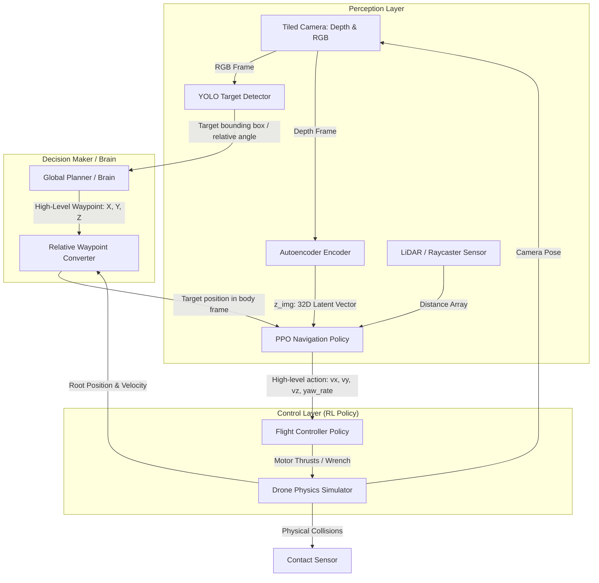

# Project Roadmap & System Architecture (1.5 Months to Presentation)

This document outlines a structured, step-by-step strategy to transition the project from the current simplified environment to a realistic, room-based arena navigation system integrated with YOLO target detection and a high-level waypoint planner.

---

## 1. System Architecture Diagram



---

## 2. Roadmap Phase-by-Phase

### Phase A: Autoencoder (AE) Retraining on Arena Map (Week 1)
Since the new map `fps_shooter_game_arena_map_v4.usdz` contains complex walls, corners, and corridors instead of simple cylinders, the current AE (trained on empty room + pillars) will produce high reconstruction error.
1.  **Modify the Data Collection Script**:
    Create a new script or modify [collect_depth_data.py](file:///d:/isaac/3D_Drone_RL/scripts/collect_depth_data.py) to:
    - Load the game arena USD instead of `Empty_Room.usd` with scale `0.01` and translation `(25.0, 25.0, -0.9937)`.
    - Randomize spawn positions and altitude in a larger range (e.g. `[-15.0, 15.0]` in X and Y) so the drone collects depth images of corridors and corners.
2.  **Train & Save**:
    Run the VAE training script and save the weights as `ae_arena.pt`. Keep the previous `ae_final.pt` model weights as a baseline comparison for the presentation.

### Phase B: LiDAR (Raycaster) Sensor Integration (Week 2)
In the real world, oracle distances to obstacles (`_compute_obstacle_distances`) are unavailable. A LiDAR sensor model (using Isaac Lab Raycaster) is the perfect replacement.
1.  **Add Raycaster Sensor**:
    Define a 2D horizontal raycaster on the drone body pointing outward in 12, 16, or 24 directions (evenly spaced `360` degrees):
    ```python
    from isaaclab.sensors import RaycasterCfg, Raycaster
    # Shoot rays horizontally from the drone body
    ```
2.  **Observation Space Update**:
    Replace the obstacle distances tensor (shape `(num_envs, num_pillars)`) in the observation vector with the ray distances (shape `(num_envs, num_rays)`).
3.  **Sim2Real Advantages**:
    Using LiDAR observations makes the policy highly robust and ready to run on a real drone (e.g., Crazyflie with a Multi-ranger deck).

### Phase C: YOLO Target Scanning (Week 3)
1.  **360-Degree Exploration Scan**:
    When the drone enters a new room or area:
    - The Global Planner tells the drone to hover and rotate `360` degrees around the Z-axis.
    - As the drone rotates, the camera feeds frames to YOLO.
2.  **Lock & Track**:
    If YOLO detects the person/target, the "Brain" records the target's relative coordinates and sets them as the new waypoint. If not, it picks the next exploration room.

### Phase D: Multi-Room Map Navigation (Weeks 4-5)
1.  **Build Rooms**:
    Use Blender or Omniverse to add dividing walls and doorways inside the USD map, creating distinct "rooms".
2.  **Hierarchical Control**:
    - **Global Planner**: Uses a simple room connectivity graph (or path search algorithm) to output waypoints.
    - **Local Controller (PPO)**: Navigates from waypoint to waypoint through doors and corridors using LiDAR to avoid walls.

### Phase E: Evaluation & Presentation Prep (Week 6)
1.  **Baselines for comparison**:
    Show the improvement in success rate:
    - *Baseline 1*: Simple room with 6 pillars (old model).
    - *Baseline 2*: Complex arena map without LiDAR (fails on walls).
    - *Proposed*: Complex arena map + LiDAR + Waypoint Planner (successful room traversal and YOLO detection).
2.  **Produce high-quality videos**:
    Use the `--enable_cameras` flag in `play.py` to record beautiful simulation walkthroughs.
